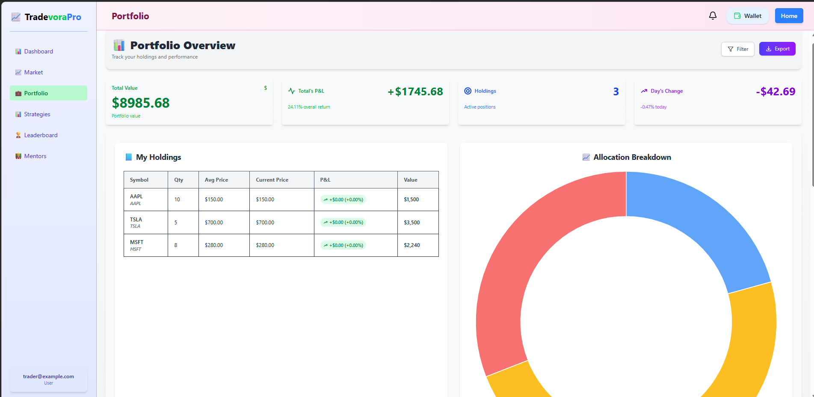

## 📈 Stock Market Platform

A full-stack stock market simulation platform with real-time data streaming, portfolio tracking, strategy management, authentication, and AI-powered insights.
Built using **Node.js**, **Express**, **Socket.IO**, **MongoDB**, **Redis**, **React**, and **FastAPI (ML Service)**.
---

# 🌐 Demo

<h2 align="center">📊 AI Trading Dashboard</h2>
<p align="center">
  
</p>

<h2 align="center">AI-powered trading signals with anomaly detection</h2>
<p align="center">
  
</p>

<h2 align="center">Latest News Section</h2>
<p align="center">
  
</p>

<p align="center">
  <b>Portfolio tracking and performance analytics</b>
</p>

<p align="center">
  
</p>

<p align="center">
  
</p>


---

## 🚀 Features

#### 🔹 Backend

- **REST API**, for portfolio, market, and order management  
- **WebSocket live feed**, using Finnhub API (`server.js`)  
- **Real-time strategies & authentication service**, (`str.js`)  
- **MongoDB**, for persistent storage  
- **Redis**, for caching and performance  

#### 🔹 AI / ML Integration

- FastAPI-based **ML microservice**
- **Trading Signal Prediction (Buy/Sell)**
- **Anomaly Detection (price & volume spikes)**
- Real-time ML inference integrated with backend  
- AI-powered explanation using Gemini API  

#### 🔹 Frontend

- **React (Vite) client**  
- **Real-time updates**, powered by Socket.IO  
- **Portfolio visualization**, trades feed, and top movers  
- **Authentication & strategy tracking**

---

## 🤖 ML Models Used

#### 📊 Trading Signal Model

- **Model:** Logistic Regression  
- **Library:** Scikit-learn  
- **Type:** Binary Classification  

Predicts whether a stock should be **Buy** or **Sell** based on historical trends.

---

#### ⚡ Anomaly Detection Model

- **Model:** Isolation Forest  
- **Library:** Scikit-learn  
- **Type:** Unsupervised Learning  

Detects unusual behavior like:
- sudden price spikes  
- abnormal volume  

---

## ⚙️ Architecture

```text
Finnhub API
   ↓
Node.js Backend (MERN)
   ↓
FastAPI ML Service (Python)
   ↓
Prediction (Buy/Sell + Anomaly)
   ↓
Node.js
   ↓
WebSocket → React UI
```
# 📂 Project Structure

```
stockmarket/
│
├── Backend/
│ ├── src/
│ │ ├── config/
│ │ ├── controllers/
│ │ │ ├── aiController.js
│ │ │ └── marketController.js
│ │ ├── middleware/
│ │ ├── models/
│ │ ├── routes/
│ │ ├── services/
│ │ ├── store/
│ │ ├── utils/
│ │ ├── server.js
│ │ └── str.js
│ │
│ ├── .dockerignore
│ ├── .env
│ ├── Dockerfile
│ ├── file.txt
│ ├── package-lock.json
│ ├── package.json
│ ├── test-gemini.js
│ ├── test-models.js
│ └── README.md
│
├── Frontend/
│ ├── node_modules/
│ ├── public/
│ ├── src/
│ ├── .dockerignore
│ ├── .env
│ ├── .gitignore
│ ├── Dockerfile
│ ├── eslint.config.js
│ ├── index.html
│ ├── package-lock.json
│ ├── package.json
│ ├── README.md
│ └── vite.config.js
│
├── ML_Service/
│ ├── .env
│ ├── dashboard.jsx
│ ├── docker-compose.yml
│ ├── leaderboard.jsx
│ ├── Login.jsx
│ ├── market.jsx
│ ├── mentor.jsx
│ ├── portfolio.jsx
│ ├── README.md
│ ├── signup.jsx
│ └── strategies.jsx
│
├── .gitignore
├── Dockerfile
└── README.md
```

---
# 🛠️ Tech Stack

### Backend
- Node.js
- Express.js
- Socket.IO
- WebSockets
- MongoDB
- Redis

### Frontend
- React (Vite)
- Context API
- Hooks

### AI / ML
- Python
- FastAPI
- Scikit-learn

### Tools
- Docker
- Git/GitHub
- Postman
- Vercel
- Render

---

# 📡 API Endpoints

| Method | Endpoint | Description |
|------|---------|-------------|
| **GET** | `/api/portfolio` | Fetch portfolio data |
| **GET** | `/api/market` | Fetch market data |
| **POST** | `/api/order` | Place an order |
| **POST** | `/api/auth` | User authentication |
| **GET** | `/api/strategies` | Fetch strategies list |
| **POST**| `/api/ai/explain/:symbol` | Get AI-powered stock explanation |
| POST | `/predict-signal` | Buy/Sell prediction |
| POST | `/detect-anomaly` | Detect anomalies |

---
### 🔄 WebSocket Events
```
marketUpdate
portfolioUpdate
pnlUpdate
tradesUpdate
strategiesUpdate
```
# 🔹 Example API Usage

### 1️⃣ Get Portfolio Data

**Request**

```
GET /api/portfolio
```

**Response**

```json
{
 "portfolioValue": 10500,
 "positions": [
  { "symbol": "AAPL", "qty": 10, "avgPrice": 150, "currentPrice": 155 },
  { "symbol": "TSLA", "qty": 5, "avgPrice": 700, "currentPrice": 710 }
 ],
 "unrealizedPnL": 200,
 "realizedPnL": 500
}
```

---

### 2️⃣ Get Market Data

**Request**

```
GET /api/market
```

**Response**

```json
[
 { "symbol": "AAPL", "price": 155.2, "change": "+0.5%" },
 { "symbol": "TSLA", "price": 710.0, "change": "-0.3%" },
 { "symbol": "NVDA", "price": 450.5, "change": "+1.2%" }
]
```

---

### 3️⃣ Place Order

**Request**

```
POST /api/order
Content-Type: application/json
```

```json
{
 "symbol": "AAPL",
 "type": "BUY",
 "qty": 5,
 "price": 156
}
```

**Response**

```json
{
 "success": true,
 "message": "Order placed successfully",
 "order": {
  "id": "ORD12345",
  "symbol": "AAPL",
  "type": "BUY",
  "qty": 5,
  "price": 156,
  "status": "EXECUTED"
 }
}
```

---

### 4️⃣ User Authentication

**Request**

```
POST /api/auth
Content-Type: application/json
```

```json
{
 "username": "rohit",
 "password": "mypassword123"
}
```

**Response**

```json
{
 "success": true,
 "token": "eyJhbGciOiJIUzI1NiIsInR5cCI..."
}
```

---

### 5️⃣ Get Strategies

**Request**

```
GET /api/strategies
```

**Response**

```json
[
 {
  "symbol": "AAPL",
  "name": "Apple",
  "roi": "+5.2%",
  "return": "$1200",
  "followers": 100,
  "winRate": "75%"
 },
 {
  "symbol": "TSLA",
  "name": "Tesla",
  "roi": "+12.3%",
  "return": "$2100",
  "followers": 150,
  "winRate": "80%"
 }
]
```

---

# 🔄 WebSocket Events

### From `server.js`

```
portfolioUpdate
pnlUpdate
tradesUpdate
marketUpdate
```

### From `str.js`

```
strategiesUpdate
```

---

# ⚙️ Installation

### 1️⃣ Clone the repository

```bash
git clone https://github.com/rohi5431/stockmarket.git
cd stockmarket
```

---

### 2️⃣ Backend Setup

```bash
cd Backend
npm install
```
3️⃣ ML Service Setup
```bash
cd ../ML_Service
pip install -r requirements.txt
uvicorn main:app --reload
```
Create a `.env` file inside **Backend/**

```
MONGO_URI=mongodb://localhost:27017/stockmarket
REDIS_HOST=127.0.0.1
REDIS_PORT=6379
FINNHUB_API_KEY=your_finnhub_api_key
GEMINI_API_KEY=your_gemini_api_key
PORT1=5000
PORT2=7000
```

---

### 3️⃣ Frontend Setup

```bash
cd ../Frontend
npm install
```

---

# ▶️ Running the Project

Run both backend and frontend servers.

### Backend

```bash
cd Backend
npm run dev
```

### Frontend

```bash
cd Frontend
npm run dev
```
### ML Service
```bash
cd ML_Service
uvicorn main:app --reload
```
Open in browser:

```
http://localhost:5173
```

---

### ✍️ Author

**Rohit Kumar**

💻 Full-Stack Developer | 📊 Stock Market Enthusiast  

- GitHub: https://github.com/rohi5431  
- LinkedIn: [Rohit Kumar  ](https://www.linkedin.com/in/rohit-kumar-3707382a2/)
- Email: rohit60316@gmail.com
